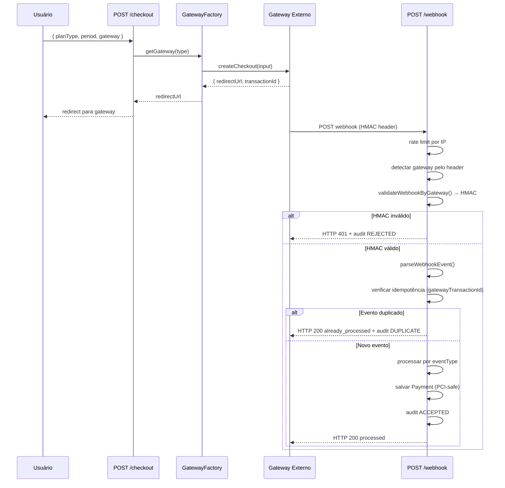

# Micro-HLD — Module 12: Gateways & Webhooks

**Data:** 2026-03-28
**Status:** APROVADO PARA INÍCIO

## Estrutura de Arquivos

```
lib/gateways/
  IGateway.ts                  ← interface comum (GatewayCheckoutInput/Result, WebhookEvent)
  GatewayFactory.ts            ← factory + singleton por tipo + detecção por header
  webhook-validator.ts         ← validadores HMAC por gateway (timingSafeEqual)
  mercadopago.ts               ← SDK Mercado Pago (redirect checkout + HMAC X-Signature)
  pagseguro.ts                 ← PagSeguro REST API (redirect checkout + HMAC PAGSEGURO-SIG)
  paypal.ts                    ← PayPal SDK (redirect checkout + Verify API)
  SECURITY-CHECKLIST.md        ← gate de segurança obrigatório pré-deploy

lib/constants/
  payment-security.ts          ← constantes PCI-DSS (campos proibidos, rate limit, timeout)

lib/config/
  gateway-env.ts               ← validação Zod das vars de ambiente dos gateways

lib/services/
  WebhookAuditService.ts       ← log de auditoria (ACCEPTED/REJECTED/DUPLICATE)
  DunningService.ts            ← retentativas D+1, D+3, D+7 (Should)
  SubscriptionService.ts       ← + cancelWithCooldown() (estorno diferencial)

lib/jobs/
  bonus-credit.ts              ← + crédito diferencial após T+7 de upgrade (G-02)
  subscription-expiry.ts       ← + reminder de renovação 7 dias antes (G-01)

app/api/v1/payments/
  checkout/route.ts            ← já existe (module-11) → wira GatewayFactory
  webhook/route.ts             ← novo: handler unificado HMAC + idempotência
  pix-checkout/route.ts        ← novo: QR Code Pix para PixQRModal

app/api/v1/admin/webhooks/
  logs/route.ts                ← endpoint paginado para admins (WebhookAuditLog)

components/payments/
  PixQRModal.tsx               ← modal QR Code Pix (Should)
```

## Fluxo de Pagamento (Redirect Checkout)



## Eventos de Webhook

| eventType | Ação | Notificação |
|-----------|------|-------------|
| PAYMENT_CONFIRMED | PlanService.upgradeUser() | PAYMENT_CONFIRMED (in-app + email) |
| PAYMENT_FAILED | subscription → PENDING | PAYMENT_FAILED (in-app + email) |
| REFUND_COMPLETED | SubscriptionService.cancelSubscription() | SUBSCRIPTION_EXPIRED |

## Segurança (PCI-DSS)

| Controle | Implementação |
|----------|--------------|
| Dados de cartão | NUNCA passam pelo servidor (redirect checkout) |
| HMAC | timingSafeEqual (sem timing attacks) |
| Replay attack | Janela 5 min por timestamp |
| Rate limit | 100 req/min por IP (Upstash) |
| Idempotência | gatewayTransactionId UNIQUE no banco |
| Audit log | 100% dos webhooks logados (90 dias) |
| Env vars | Nunca hardcoded — validação Zod no startup |
